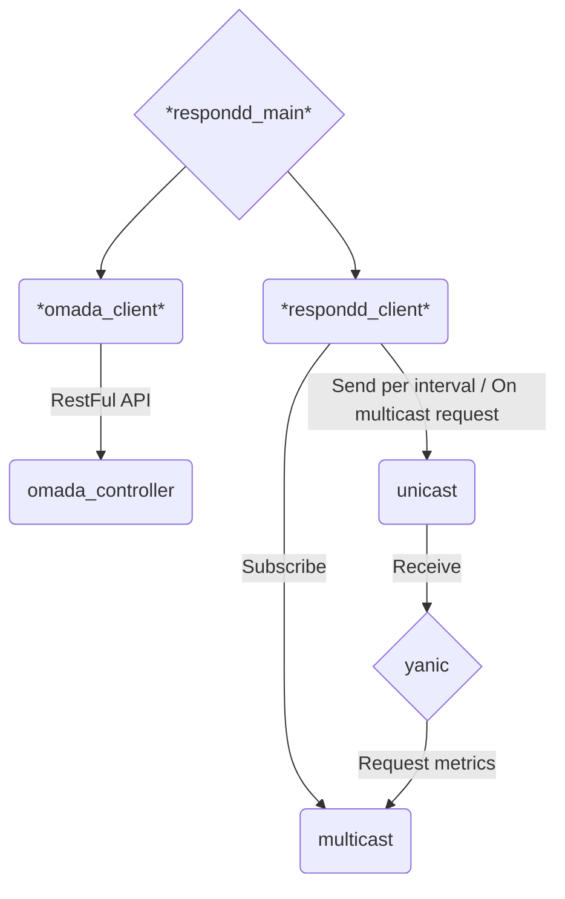

# omada_respondd

This queries the API of a Omada controller to get the current status of the Accesspoints and sends the information via the respondd protocol. Thus it can be picked up by `yanic` and other respondd queriers.

## Overview


## Linking an Offloader to an Omada Site by MAC Address

To link an offloader to your site in omada_respondd, specify the MAC address of the offloader in your YAML configuration file. This enables omada_respondd to identify the offloader device and mark it correctly on the map.

### Steps

1. Open your omada_respondd YAML configuration file (e.g., `omada_respondd.yaml`).
2. Add or find the section for offloader settings. (Seactionname `offloader_mac`
3. Insert the MAC address of your offloader device like this:
```yaml
offloader_mac:
    SiteName: 00:00:00:00:00:00
```
4. Save the YAML file.
5. Restart the omada_respondd service to apply the changes.


## Setting Location for Omada Devices

To set the GPS location of each Omada Access Point (AP):

1. Open the Omada Controller web interface.
2. Go to the **Devices** section.
3. Select the Access Point you want to configure.
4. Click on **Config** for that AP.
5. Under **Services**, enter the GPS coordinates as latitude and longitude separated by a comma in the **Location** field under **SNMP**, e.g., `48.1351, 11.5820`.
6. Save your changes.
7. Restart the omada_respondd service to apply the changes.

This sets the location for the AP, helping with accurate device placement on Freifunk maps.


## Setting Contact Information for Omada Devices

To set contact information for each Omada Access Point (AP):

1. Open the Omada Controller web interface.
2. Go to the **Devices** section.
3. Select the Access Point you want to configure.
4. Click on **Config** for that AP.
5. Under **Services**, enter contact details (email, phone, etc.) in the **Contact** field under **SNMP**.
6. Save your changes.
7. Restart the omada_respondd service to apply the changes.

This free-text field helps identify device ownership or provides general contact info which is shown on the Freifunk maps.
