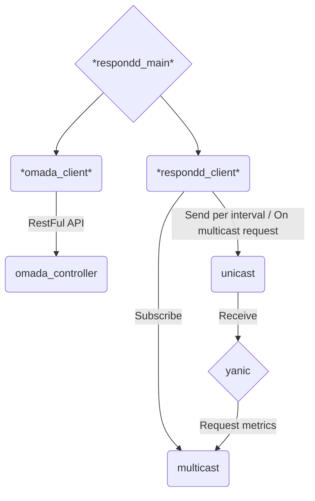

# omada_respondd

This queries the API of a Omada controller to get the current status of the Accesspoints and sends the information via the respondd protocol. Thus it can be picked up by `yanic` and other respondd queriers.

## Overview

